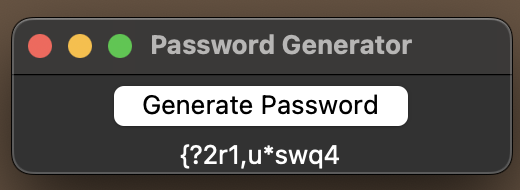

# random-password-generator

### Quick Overview
 
Created this project to generate a random secure password that can be used on simple cryptographic apps. 

------------------------

## Files in this project:

* random-password-generator.py

This file includes a simple code, that takes user inputs to create a password. Password length should be more than 7 (exclusive). A password can be generated to either include special characters or without. 

If special characters are not included, the password will include both digits and letters.

* pass-generator-app.py

This is another version using Python Tkinter GUI. Currently, I made it with static variables, so when the user clicks the generate button, they will get a 12-character password that includes special characters. Hoping to add more features in the future to make it more customizable.

